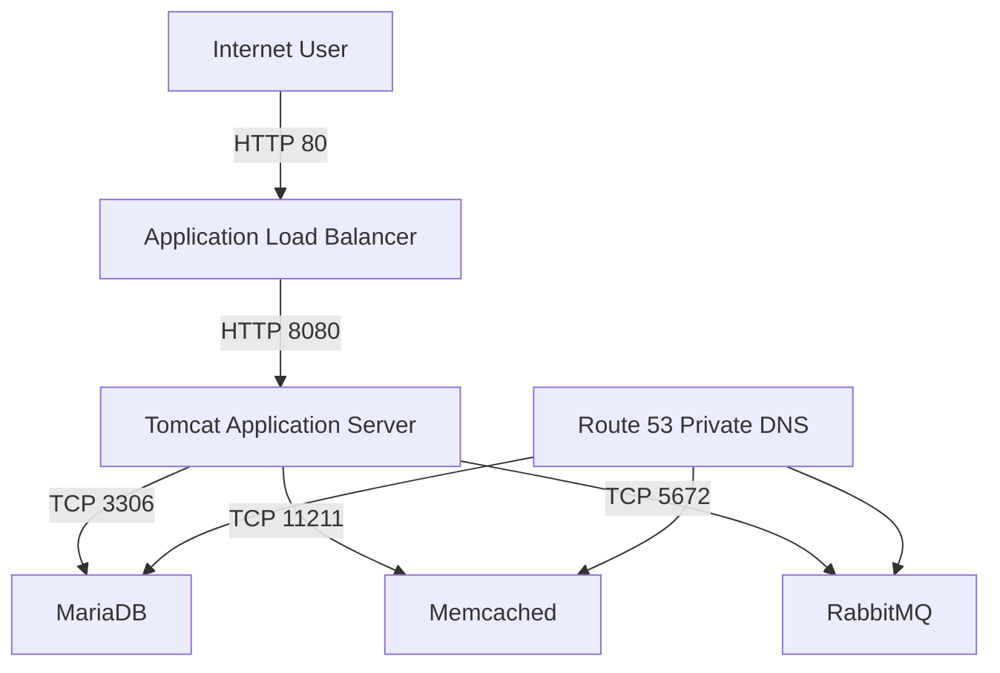

# VProfile Manual Deployment on AWS

A hands-on project to deploy the VProfile Java application manually on AWS using the AWS Management Console.

This repository explains the deployment in simple steps, including the problems I faced and how I solved them.

---

## Project Goal

The goal was to move VProfile from a local virtual-machine environment to AWS.

In this project, I used:

- Amazon VPC
- Public and private subnets
- Amazon EC2
- Application Load Balancer
- Route 53 Private Hosted Zone
- AWS Systems Manager
- Security Groups
- MariaDB
- Memcached
- RabbitMQ
- Apache Tomcat

Terraform, Docker, and Kubernetes were not used in this project.

---

## Architecture



The application uses these private DNS names:

```text
db.vprofile.internal
cache.vprofile.internal
mq.vprofile.internal
```

---

## Request Flow

```text
Internet User
      |
      v
Application Load Balancer
      |
      v
Tomcat Application
      |
      +----> MariaDB
      +----> Memcached
      +----> RabbitMQ
```

Only the Application Load Balancer is publicly accessible.

The application and backend services run inside private subnets.

---

## What I Deployed

| Component | Purpose | Port |
|---|---|---:|
| Application Load Balancer | Public application entry point | `80` |
| Apache Tomcat | Runs the Java application | `8080` |
| MariaDB | Stores permanent application data | `3306` |
| Memcached | Stores temporary cached data | `11211` |
| RabbitMQ | Handles application messages | `5672` |
| Route 53 | Provides private DNS names | DNS |

The application was deployed as:

```text
ROOT.war
```

The public application URL was:

```text
http://<ALB-DNS-NAME>/login
```

---

## Repository Structure

```text
.
├── README.md
├── LICENSE
├── docs/
│   ├── 01-project-overview.md
│   ├── 02-architecture.md
│   ├── 03-vpc-and-networking.md
│   ├── 04-security-groups.md
│   ├── 05-iam-and-session-manager.md
│   ├── 06-database-setup.md
│   ├── 07-memcached-setup.md
│   ├── 08-rabbitmq-setup.md
│   ├── 09-tomcat-deployment.md
│   ├── 10-route53-private-dns.md
│   ├── 11-alb-configuration.md
│   ├── 12-testing.md
│   ├── 13-troubleshooting.md
│   └── 14-cleanup.md
├── scripts/
│   ├── mariadb-setup.sh
│   ├── memcached-setup.sh
│   ├── rabbitmq-setup.sh
│   └── tomcat-setup.sh
├── diagrams/
└── screenshots/
```

---

## Deployment Guide

Follow the documentation in this order:

1. [Project Overview](docs/01-project-overview.md)
2. [Architecture Design](docs/02-architecture.md)
3. [VPC and Networking](docs/03-vpc-and-networking.md)
4. [Security Groups](docs/04-security-groups.md)
5. [IAM and Session Manager](docs/05-iam-and-session-manager.md)
6. [MariaDB Setup](docs/06-database-setup.md)
7. [Memcached Setup](docs/07-memcached-setup.md)
8. [RabbitMQ Setup](docs/08-rabbitmq-setup.md)
9. [Tomcat Deployment](docs/09-tomcat-deployment.md)
10. [Route 53 Private DNS](docs/10-route53-private-dns.md)
11. [Application Load Balancer](docs/11-alb-configuration.md)
12. [Testing](docs/12-testing.md)
13. [Troubleshooting](docs/13-troubleshooting.md)
14. [Cleanup](docs/14-cleanup.md)

---

## Main Problems I Faced

### EC2 did not appear in Session Manager

The EC2 instance did not have the correct IAM Instance Profile.

I attached an IAM role containing:

```text
AmazonSSMManagedInstanceCore
```

---

### MariaDB worked locally but not remotely

MariaDB was listening only on localhost.

I changed the configuration to:

```ini
[mysqld]
bind-address=0.0.0.0
```

The Security Group allowed port `3306` only from the Tomcat Security Group.

---

### Memcached could not be reached from Tomcat

Memcached was listening only on `127.0.0.1`.

I changed it to:

```text
OPTIONS="-l 0.0.0.0 -U 0"
```

---

### RabbitMQ returned `ACCESS_REFUSED`

The RabbitMQ user existed but did not have permissions on virtual host `/`.

I added the required permissions:

```bash
sudo rabbitmqctl set_permissions \
  -p / \
  vprofile_app \
  ".*" \
  ".*" \
  ".*"
```

---

### ALB target was unhealthy

I verified:

```text
Target Group Port: 8080
Health Check Path: /login
Success Codes: 200-399
```

I also allowed port `8080` from the ALB Security Group to the Tomcat Security Group.

---

## Testing

From the Tomcat server:

```bash
getent hosts db.vprofile.internal
getent hosts cache.vprofile.internal
getent hosts mq.vprofile.internal

nc -zv db.vprofile.internal 3306
nc -zv cache.vprofile.internal 11211
nc -zv mq.vprofile.internal 5672

curl -I http://localhost:8080/login
```

Final public test:

```bash
curl -I http://<ALB-DNS-NAME>/login
```

Expected result:

```text
HTTP/1.1 200
```

---

## Important Security Notes

- Backend services are not publicly accessible.
- SSH port `22` was not opened.
- EC2 access was performed using Session Manager.
- Security Groups reference other Security Groups.
- Real passwords and AWS credentials are not stored in this repository.
- Example values must be replaced before running the scripts.

---

## Lab Limitations

This is a learning project, not a full production environment.

To reduce cost:

- One Tomcat instance was used.
- One instance was used for each backend service.
- One NAT Gateway was used.
- Elasticsearch was not included.
- HTTPS and Auto Scaling were not configured.

A production architecture could use:

- Auto Scaling Group
- Amazon RDS Multi-AZ
- Amazon ElastiCache
- Amazon MQ
- AWS Certificate Manager
- AWS Secrets Manager
- CloudWatch monitoring

---

## What I Learned

Through this project, I practiced:

- Designing an AWS VPC
- Creating public and private subnets
- Configuring route tables and a NAT Gateway
- Protecting services using Security Groups
- Accessing private EC2 instances using Session Manager
- Installing and configuring Linux services
- Deploying a Java WAR application on Tomcat
- Using private DNS instead of fixed IP addresses
- Configuring an Application Load Balancer
- Reading logs and troubleshooting service communication

---

## Cleanup

AWS resources may continue to generate costs.

Follow the cleanup guide after completing the lab:

[Cleanup Guide](docs/14-cleanup.md)

---

## Disclaimer

This repository is for learning and demonstration purposes.

Do not store real passwords, AWS access keys, tokens, or other secrets inside a public GitHub repository.

---

## License

This project is available under the [MIT License](LICENSE).

---

## Architecture


The architecture uses an internet-facing Application Load Balancer as the only public entry point.

Tomcat and all backend services run inside private subnets.

The application communicates with the backend services using Route 53 private DNS names:

```text
db.vprofile.internal
cache.vprofile.internal
mq.vprofile.internal
```

The editable Mermaid source is available here:

[View Architecture Diagram Source](diagrams/architecture.mmd)